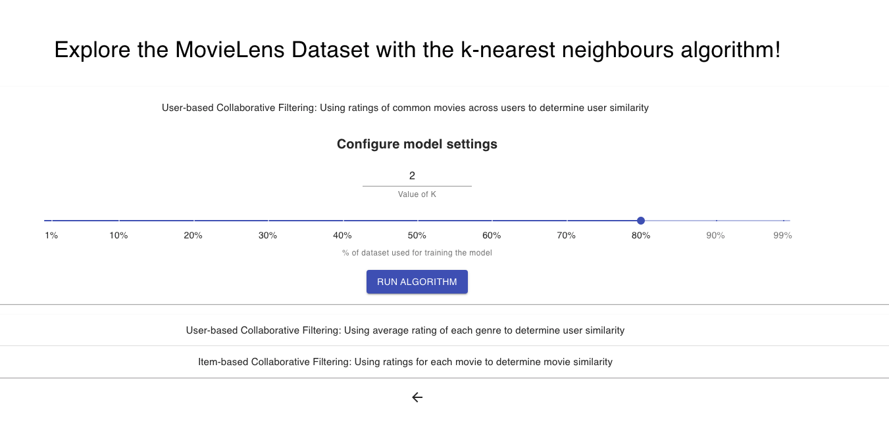

# playground

## About
_playground_ is an interactive journal of all the work I have done as part of GovTech's Girls in Tech mentorship programme. 

My goal for the programme was to get a feel of some basic machine learning algorithms through developing a simple **movie recommendation system**.

## Dataset
[MovieLens Small Dataset](https://www.kaggle.com/shubhammehta21/movie-lens-small-latest-dataset).

## Exploratory Data Analysis
- Unique genres
- Number of ratings per genre 
- Average rating for each genre

## Model
Both **user-based collaborative filtering** and **item-based collaborative filtering** were explored. The classic **k-nearest neighbours** algorithm was used to train the models. 

_User-based collaborative filtering_:  
1. Use ratings of most common movies across users to determine user similarity.    
2. Use users' average ratings of each genre to determine user similarity.

_Item-based collaborative filtering_:  
1. Use user ratings to determine movie similarity.

## Development
Tech stack: Flask + React